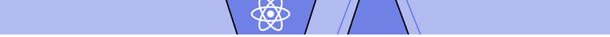

<h1 align="center">Full-Stack-open-2022 Exercises - The University of Helsinki</h1>

<h4 align="center">Project &amp; exercises of the Full Stack open 2022</h4>

 
  Learn React, Redux, Node.js, MongoDB, GraphQL and TypeScript in one go! This course will introduce you to modern JavaScript-based web development. The main focus is on building single page applications with ReactJS that use REST APIs built with Node.js
  
  
  

