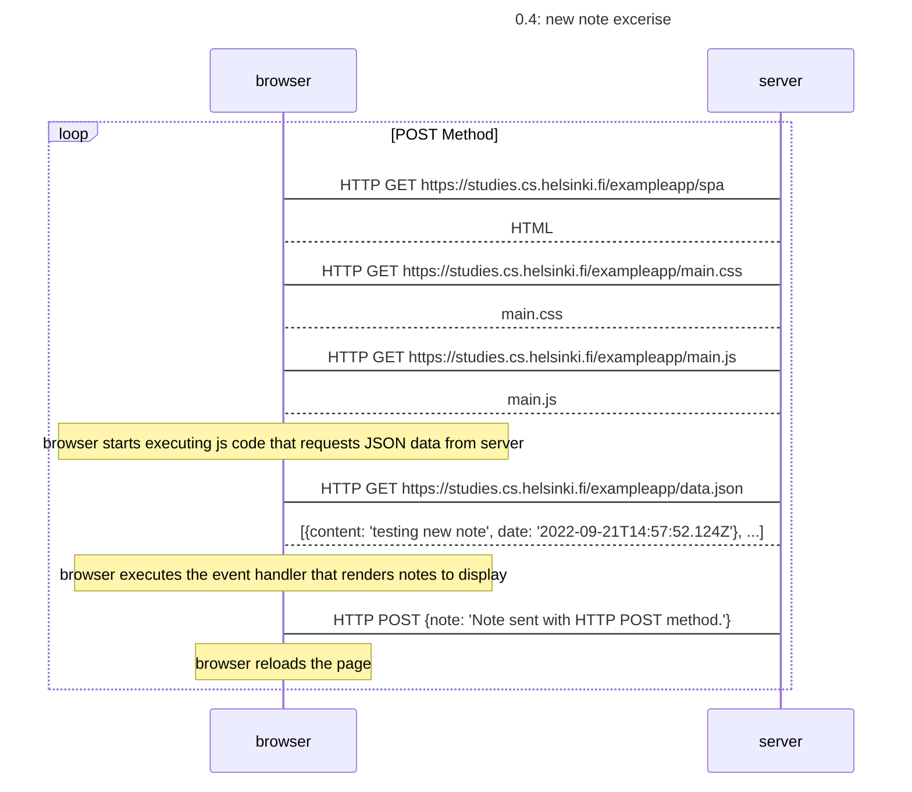
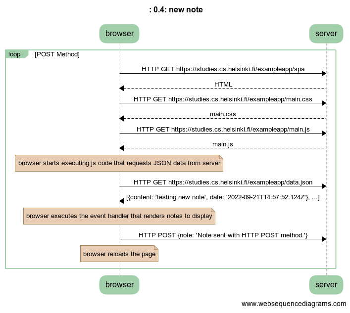

#0.4: new note

```mermaid
sequenceDiagram
Title: 0.4: new note excerise

    loop  POST Method
        browser->server: HTTP GET https://studies.cs.helsinki.fi/exampleapp/spa
        server-->browser: HTML
        browser->server: HTTP GET https://studies.cs.helsinki.fi/exampleapp/main.css
        server-->browser: main.css
        browser->server: HTTP GET https://studies.cs.helsinki.fi/exampleapp/main.js
        server-->browser: main.js

        note over browser: browser starts executing js code that requests JSON data from server

        browser->server: HTTP GET https://studies.cs.helsinki.fi/exampleapp/data.json
        server-->browser: [{content: 'testing new note', date: '2022-09-21T14:57:52.124Z'}, ...]

        note over browser: browser executes the event handler that renders notes to display

        browser->server: HTTP POST {note: 'Note sent with HTTP POST method.'}

        note over browser: browser reloads the page
    end


```

   
  

  
