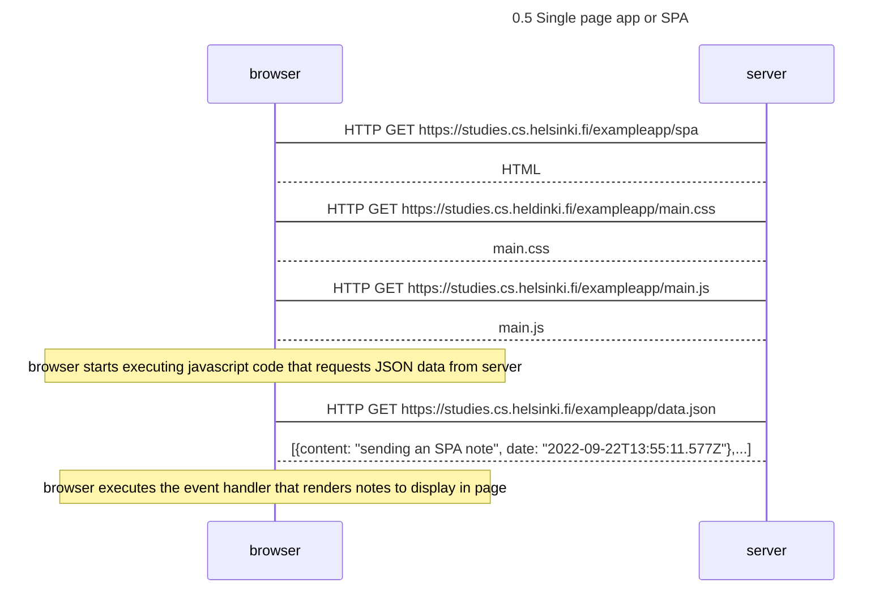
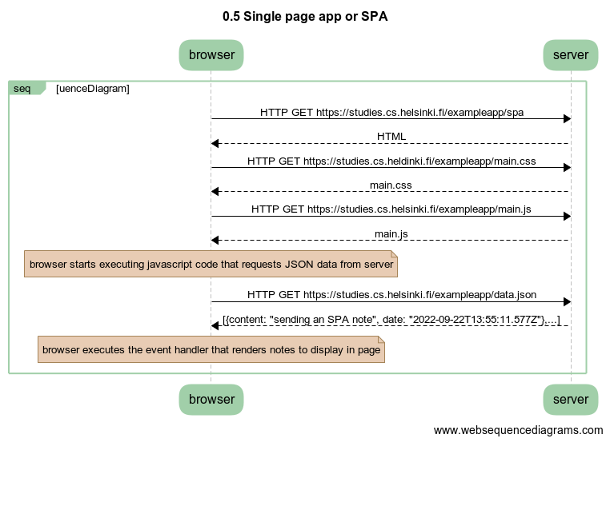

# 0.5 Single Page APP (SPA)



```mermaid
sequenceDiagram

title 0.5 Single page app or SPA


browser->server: HTTP GET https://studies.cs.helsinki.fi/exampleapp/spa
server-->browser: HTML
browser->server: HTTP GET https://studies.cs.heldinki.fi/exampleapp/main.css
server-->browser: main.css
browser->server: HTTP GET https://studies.cs.helsinki.fi/exampleapp/main.js
server-->browser: main.js

note over browser: browser starts executing javascript code that requests JSON data from server
browser->server: HTTP GET https://studies.cs.helsinki.fi/exampleapp/data.json
server-->browser: [{content: "sending an SPA note", date: "2022-09-22T13:55:11.577Z"},...]

note over browser: browser executes the event handler that renders notes to display in page
```


```html
<body>

</body>
```


```css
body{
margin: 0px;
}
```
