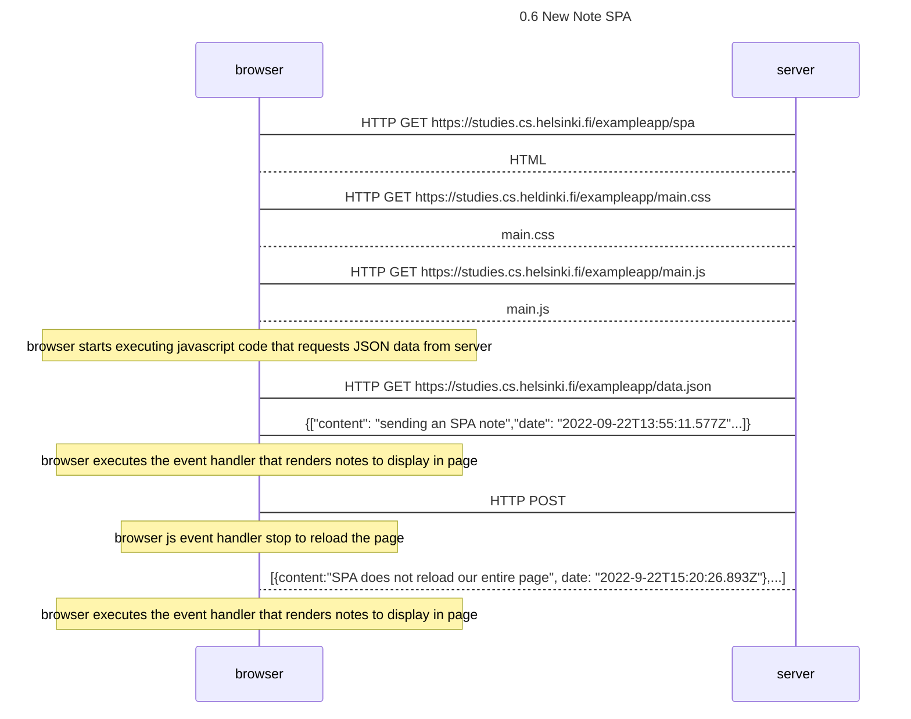

# 0.6 New Note SPA

```mermaid
sequenceDiagram


title 0.6 New Note SPA


browser->server: HTTP GET https://studies.cs.helsinki.fi/exampleapp/spa
server-->browser: HTML
browser->server: HTTP GET https://studies.cs.heldinki.fi/exampleapp/main.css
server-->browser: main.css
browser->server: HTTP GET https://studies.cs.helsinki.fi/exampleapp/main.js
server-->browser: main.js
note over browser: browser starts executing javascript code that requests JSON data from server
browser->server: HTTP GET https://studies.cs.helsinki.fi/exampleapp/data.json
server->browser: {["content": "sending an SPA note","date": "2022-09-22T13:55:11.577Z"...]}
note over browser: browser executes the event handler that renders notes to display in page


browser->server: HTTP POST
note over browser: browser js event handler stop to reload the page

server-->browser: [{content:"SPA does not reload our entire page", date: "2022-9-22T15:20:26.893Z"},...]
note over browser: browser executes the event handler that renders notes to display in page


```

